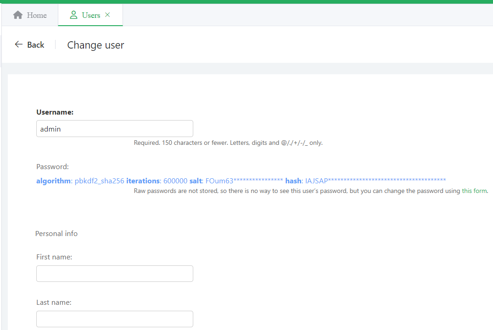

# 软件工程大作业报告

| 姓名   | 学号    |
| ------ | ------- |
| 怀硕   | 2112426 |
| 吴振华 | 2110408 |
| 王祎宁 | 2113635 |
| 唐瑚   | 2113094 |

Github项目地址：https://github.com/passer12/aiops


## 项目概述

### 项目目标

创建一个网站，使用大模型等人工智能工具，对GitHub仓库文件进行智能分析，提供改进建议，同时包含用户管理、仓库管理、日志记录、管理员管理数据等功能。

### 开发环境

前端使用Vue3 + PrimeVue编写

后端使用Django

使用Docker-Compose进行部署，可同时运行在多种操作系统中

### 可行性分析

####  技术可行性

1. **前端开发**
   - **Vue3**：Vue3 是一个渐进式JavaScript框架，适用于构建用户界面。它的组合式API和高性能特性使其成为现代前端开发的理想选择。
   - **PrimeVue**：PrimeVue 是一个全面的UI组件库，提供丰富的组件集，可以大大加速前端开发，提升用户体验。
2. **后端开发**
   - **Django**：Django 是一个高层次的Python Web框架，强调快速开发和简洁设计。它提供了强大的ORM、用户认证系统和管理员界面，非常适合构建复杂的Web应用。
   - **大模型接入**：可以通过API调用OpenAI等大模型服务，对GitHub仓库文件进行智能分析并提供改进建议。
3. **部署**
   - **Docker-Compose**：使用Docker-Compose可以在多个容器中管理应用的不同服务，确保应用可以在不同操作系统上无缝运行，简化了部署和环境配置。

#### 功能可行性

1. **用户管理**：
   - **Django**：Django自带的用户管理系统可以轻松实现用户注册、登录、权限管理等功能。
   - **Vue3 + PrimeVue**：前端可以使用PrimeVue的表单和验证组件，与后端API进行交互，实现用户管理功能。
2. **仓库管理**：

   - **Django**：使用Django的ORM模型来管理仓库信息，包括仓库的增删改查。
   - **Vue3 + PrimeVue**：前端可以展示仓库列表，并提供用户友好的操作界面。
3. **日志记录**：

   - **Django**：可以使用中间件或信号机制来记录用户操作日志，并存储在数据库中。
   - **Vue3 + PrimeVue**：前端可以展示操作日志，并支持筛选和分页功能。
4. **智能分析**：

   - **API调用**：通过后端调用大模型API（如OpenAI），对GitHub仓库文件进行分析，返回改进建议。
   - **数据展示**：前端将分析结果以用户友好的方式展示给用户，并提供导出功能。
5. **管理员权限**：

   - **Django**：Django自带的管理员界面可以完成基础功能。使用开源库可对其进行美化


## 需求分析

### 功能需求

#### **用户管理**

- **用户注册**：用户可以通过注册页面创建新账号。
- **用户登录**：已注册用户可以通过登录页面访问系统。
- **用户角色与权限**：系统应支持不同用户角色（如管理员、普通用户），并根据角色分配不同权限。
- **用户资料管理**：用户可以查看和编辑个人资料。

#### **仓库管理**

- **仓库添加**：用户可以添加新的GitHub仓库，系统应支持通过API获取仓库信息。
- **仓库列表**：用户可以查看自己添加的仓库列表。
- **仓库删除**：用户可以删除自己添加的仓库。
- **仓库修改**：用户可以修改自己的仓库信息
- **仓库详情**：用户可以查看仓库的详细信息，包括文件列表和分析结果。

#### **智能分析**

- **分析触发**：用户可以手动触发对某个仓库的分析

- **分析结果展示**：系统应展示对仓库文件的分析结果，包括改进建议和具体细节。

- **历史分析结果**：系统应保存上次分析的结果，以供用户查阅

- **模型配置**：用户应能够自主选择当前分析所使用的模型配置模型配置

#### **日志记录**

- **操作日志**：系统应记录用户的关键操作（如添加仓库、触发分析），并提供日志查看功能。

#### 管理员模式

- **数据库修改**：管理员应可以浏览所有数据表，并可以对其进行增删改查。
- **操作日志**：应记录管理员的数据表操作，以供查看

### 非功能需求

#### **性能**

- **响应时间**：系统的页面加载时间应在合理范围内（如3秒以内）。
- **并发处理**：系统应能够处理一定量的并发用户请求，确保稳定性和响应速度。

#### **安全性**

- **数据加密**：用户数据和仓库信息应进行加密存储和传输，确保数据安全。
- **身份验证**：用户登录应采用安全的身份验证机制（如JWT），防止未经授权的访问。
- **权限控制**：根据用户角色分配权限，防止越权操作。

#### **可维护性**

- **代码结构**：采用模块化设计，代码结构清晰，易于维护和扩展。
- **文档**：提供完整的技术文档和用户手册，便于开发和使用。

#### **可用性**

- **用户界面**：界面设计应简洁直观，用户操作方便。
- **错误处理**：系统应提供友好的错误提示和处理机制，帮助用户解决问题。
- **主题设置**：系统应允许用户进行明亮主题和暗黑主题切换

#### **兼容性**

- **浏览器兼容**：系统应支持主流浏览器（如Chrome、Firefox、Safari、Edge）并保证兼容性。
- **设备兼容**：系统应适配不同设备（如PC、手机、平板），提供良好的用户体验。

#### **扩展性**

- **模块化设计**：系统设计应具备良好的扩展性，便于后续功能的增加和优化。
- **第三方集成**：支持与第三方工具和服务的集成（如GitHub API、大预语言模型API），提升系统功能和性能。

## 系统设计

### 系统架构

- 前端：Vue3 + PrimeVue，负责用户界面和交互
- 后端：Django，负责API服务，业务逻辑和数据处理
- 部署：通过Docker-Compose管理前后端服务和数据库，简化部署流程。

### 功能模块设计

#### 前端

- 用户管理模块
- 仓库管理模块
- 分析结果展示模块
- 日志查看模块

#### **后端**

- 用户认证和权限管理模块
- 仓库信息管理模块
- 分析任务调度和结果管理模块
- 日志记录和查询模块

### 详细设计

#### API设计

我们使用postman作为api测试工具，下图展示了我们实现的大部分api，功能如名


##### 用户认证API

包含的API功能有创建用户、创建jwt token、刷新jwt token、验证jwt token 

该模块完成了从用户创建，到身份维持的各方面功能。

这部分我们通过调用`djoser`和`rest_framework`实现

##### 仓库管理API

包含的API功能就是对仓库的增删改查

```python

# 获取用户的所有仓库，以及创建新的
@api_view(['GET', 'POST'])
def repos(request):
    # 验证JWT令牌，考虑在每一个请求前都加上这个验证
    jwt_authenticator = JWTAuthentication()
    user, token = jwt_authenticator.authenticate(request)

    if not user:
        return JsonResponse({'error': 'Invalid token'}, status=401)

    # 假设用户已经通过身份验证，现在可以获取用户的所有仓库
    if request.method == 'GET':
        # 获取用户的所有仓库
        user_repos = user.repository_set.all().values()
        print(user_repos)

        return JsonResponse(list(user_repos), safe=False)

    elif request.method == 'POST':
        # 创建一个新的仓库
        repo_data = request.data
        new_repo_data = {'Name': repo_data['Name'],
                         'Description': repo_data['Description'],
                         'Link': repo_data['Link'],
                         'Owner': user.pk}
        # 为repo_data添加一个Owner字段,但是由于他是QueryDick类型，所以不能直接添加
        # print(repo_data)
        repo_serializer = RepositorySerializer(data=new_repo_data)

        if repo_serializer.is_valid():
            repo_serializer.save()
            return JsonResponse(repo_serializer.data, status=201)

        return JsonResponse(repo_serializer.errors, status=400)


# 获取、更新、删除仓库信息
@api_view(['GET', 'PATCH', 'DELETE'])
def repos_detail(request, repo_id):
    # 验证JWT令牌，考虑在每一个请求前都加上这个验证
    jwt_authenticator = JWTAuthentication()
    user, token = jwt_authenticator.authenticate(request)

    if not user:
        return JsonResponse({'error': 'Invalid token'}, status=401)

    if request.method == 'GET':
        # 获取仓库信息
        try:
            repo = Repository.objects.get(RepositoryID=repo_id, Owner=user.pk+1)
            repo_serializer = RepositorySerializer(repo)
            return JsonResponse(repo_serializer.data)

        except Repository.DoesNotExist:
            return JsonResponse({'error': 'Repository not found'}, status=404)

    elif request.method == 'PATCH':
        #print("a pathc")
        #print(request.data)
        # 更新仓库信息
        try:
            repo = Repository.objects.get(RepositoryID=repo_id, Owner=user.pk)
            repo_data = request.data

            if 'Owner' in repo_data: #用户字段不可修改
                return JsonResponse({'error': 'Cannot update owner field'}, status=400)

            repo_serializer = RepositorySerializer(repo, data=repo_data, partial=True)

            if repo_serializer.is_valid():
                repo_serializer.save()
                return JsonResponse(repo_serializer.data)

            return JsonResponse(repo_serializer.errors, status=400)

        except Repository.DoesNotExist:
            return JsonResponse({'error': 'Repository not found'}, status=404)

    elif request.method == 'DELETE':
        # 删除仓库
        try:
            repo = Repository.objects.get(RepositoryID=repo_id, Owner=user.pk)

            # 在删除仓库之前，记录用户操作
            UserAction.objects.create(
                user=request.user,
                action=f"Accessed {request.path}",
                method=request.method,
                status_code=204,
                payload=repo.Name
            )
            repo.delete()
            return JsonResponse({'message': 'Repository deleted successfully'}, status=204)

        except Repository.DoesNotExist:
            return JsonResponse({'error': 'Repository not found'}, status=404)
```

##### 用户配置信息API

该部分包含用户配置信息的增删改查，实现过程类似于仓库管理

```python

# Create your views here.
@api_view(['GET', 'PATCH', 'POST'])
def profile(request):
    # 验证JWT令牌，考虑在每一个请求前都加上这个验证
    jwt_authenticator = JWTAuthentication()
    user, token = jwt_authenticator.authenticate(request)

    if user is None:
        return JsonResponse({'error': 'Invalid token'}, status=401)

    # 假设用户已经通过身份验证，现在可以获取用户的配置信息
    if request.method == 'GET':
        try:
            # 获取用户的所有仓库
            user_profile = ProfileSerializer(user.profile)
            print(user_profile.data)
            return JsonResponse(user_profile.data, safe=False)

        except UserProfile.DoesNotExist:
            return JsonResponse({'error': 'User profile not found'}, status=404)

    #
    elif request.method == 'POST':  #
        try:
            # 创建一个新的配置信息
            profile_data = request.data
            new_profile_data = {'name' : user.username,
                                'email': profile_data['email'],
                                'description': profile_data['description'],
                                'link': profile_data['Link'],
                                'Owner': user.pk,
                                'access_token': profile_data['access_token']}
            # 为repo_data添加一个Owner字段,但是由于他是QueryDick类型，所以不能直接添加
            # print(repo_data)
            profile_serializer = ProfileSerializer(data=new_profile_data)

            if profile_serializer.is_valid():
                profile_serializer.save()
                return JsonResponse(profile_serializer.data, status=201)

            return JsonResponse(profile_serializer.errors, status=400)

        except KeyError as e:
            return JsonResponse({'error': f'Missing field: {str(e)}'}, status=400)

        except Exception as e:
            return JsonResponse({'error': str(e)}, status=500)

    elif request.method == 'PATCH':
        try:
            # 更新用户的配置信息
            profile_data = request.data
            print(profile_data)

            if "name" in profile_data or "Owner" in profile_data or 'avatar' in profile_data:
                # 如果请求中包含id或owner字段，则返回不能请求
                return JsonResponse({'error': 'Cannot update name or owner or avatar fields'}, status=400)

            # 为repo_data添加一个Owner字段,但是由于他是QueryDick类型，所以不能直接添加
            # print(repo_data)
            profile_serializer = ProfileSerializer(user.profile, data=profile_data, partial=True)

            if profile_serializer.is_valid():
                profile_serializer.save()
                return JsonResponse(profile_serializer.data, status=201)

            return JsonResponse(profile_serializer.errors, status=400)

        except Exception as e:
            return JsonResponse({'error': str(e)}, status=500)

    return JsonResponse({'error': 'Invalid request method'}, status=405)


# 上传头像
@api_view(['POST'])
def upload_avatar(request):
    # 验证JWT令牌，考虑在每一个请求前都加上这个验证
    jwt_authenticator = JWTAuthentication()
    user, token = jwt_authenticator.authenticate(request)

    if user is None:
        return JsonResponse({'error': 'Invalid token'}, status=401)

    try:
        if request.method == 'POST':
            avatar = request.FILES['avatar']
            # print(avatar.content_type)
            # 确保文件是一个有效的图像文件
            if not validate_image(avatar):
                return JsonResponse({'status': 'error', 'message': 'Invalid image file.'}, status=400)

            user_profile = user.profile
            # 更新用户资料中的头像
            user_profile.avatar = avatar
            user_profile.save()

            # 返回成功的响应
            return JsonResponse({'status': 'success', 'message': 'Avatar uploaded successfully.'})
        else:
            return JsonResponse({'error': 'Invalid request method'}, status=405)

    except KeyError as e:
        return JsonResponse({'error': f'Missing field: {str(e)}'}, status=400)
    except Exception as e:
        return JsonResponse({'error': str(e)}, status=500)
```

##### 历史记录API

对用户的操作进行记录，提供一个API以供用户访问获取自身历史记录,并将其划分为今天和之前的记录。历史记录的实现是通过注册中间件获取用户对API的访问请求的

```python
@api_view(['GET'])
def UserActionHistory(request):
    # 验证JWT令牌
    jwt_authenticator = JWTAuthentication()
    user, token = jwt_authenticator.authenticate(request)

    if not user:
        return JsonResponse({'error': 'Invalid token'}, status=401)

    # 获取当前日期
    today = datetime.now().date()

    # 获取用户的所有操作记录中 action 字段包含 "/api/repos/"，method 为 POST, PATCH 或 DELETE 的记录
    user_actions = UserAction.objects.filter(
        user=user,
        action__contains='/api/repos/',
        method__in=['POST', 'PATCH', 'DELETE']
    ).order_by('-timestamp')

    # 分离今天的记录和之前的记录
    today_actions = []
    before_actions = []

    for action in user_actions:
        if action.timestamp.date() == today:
            today_actions.append(action)
        else:
            before_actions.append(action)

    # 序列化记录
    today_actions_data = [
        {
            'action': action.action,
            'method': action.method,
            'status_code': action.status_code,
            'payload': action.payload,
            'timestamp': action.timestamp
        }
        for action in today_actions
    ]

    before_actions_data = [
        {
            'action': action.action,
            'method': action.method,
            'status_code': action.status_code,
            'payload': action.payload,
            'timestamp': action.timestamp
        }
        for action in before_actions
    ]

    # 返回 JSON 响应
    return JsonResponse({
        'today': today_actions_data,
        'before': before_actions_data
    })

```

##### 评估API

待补充


#### 数据库设计

我们的项目总共包含16个数据表，其中除去10个由django自动生成的表之外，我们设计的6个表如下

| 表名        | 描述                                                         |
| ----------- | ------------------------------------------------------------ |
| Repository  | 存储项目仓库的信息，包括名称、描述、GitHub链接等。每个仓库由一个用户所有，记录了创建时间和评估状态。 |
| TreeNode    | 用于表示树形结构中的节点，每个节点关联到一个特定的仓库。每个节点具有一个唯一的键值和标签，可以有父子节点关系。 |
| NodeData    | 存储与每个 TreeNode 相关联的详细数据，如标题和内容。         |
| UserConfig  | 用于存储用户特定的配置信息，包括应用ID、API密钥、版本号、令牌数量限制和温度值。每个配置属于一个用户，通过与用户模型的一对一关系进行关联。 |
| UserProfile | 存储用户的个人信息，包括用户名、邮箱、个人简介、头像、个人主页链接等。每个用户只有一个个人资料，通过与用户模型的一对一关系进行关联。记录了个人资料的创建时间和访问令牌。 |

详细结构如下

**Repository模型类** 

用户仓库管理

| 字段名       | 类型          | 选项                            | 说明       |
| ------------ | ------------- | ------------------------------- | ---------- |
| RepositoryID | AutoField     | primary_key=True                | 仓库ID     |
| Name         | CharField     | max_length=255, unique=True     | 仓库名称   |
| Description  | TextField     |                                 | 仓库描述   |
| Link         | URLField      | blank=True                      | GitHub链接 |
| CreateTime   | DateTimeField | auto_now_add=True               | 创建时间   |
| Owner        | ForeignKey    | User, on_delete=models.CASCADE  | 所有者     |
| status       | CharField     | max_length=20, default='未评估' | 评估状态   |

**`TreeNode` 模型类**

| 字段名 | 类型       | 选项                                                         | 说明       |
| ------ | ---------- | ------------------------------------------------------------ | ---------- |
| repo   | ForeignKey | Repository, on_delete=models.CASCADE, related_name='nodes'   | 关联的仓库 |
| key    | CharField  | max_length=100                                               | 键值       |
| label  | CharField  | max_length=255                                               | 标签       |
| parent | ForeignKey | self, null=True, blank=True, on_delete=models.CASCADE, related_name='children' | 父节点     |


Nodedata模型类

| 字段名  | 类型       | 选项                                                    | 说明       |
| ------- | ---------- | ------------------------------------------------------- | ---------- |
| node    | ForeignKey | TreeNode, on_delete=models.CASCADE, related_name='data' | 关联的节点 |
| title   | CharField  | max_length=255                                          | 标题       |
| content | TextField  |                                                         | 内容       |


UserConfig 模型类

| 字段名      | 类型          | 选项                                                  | 说明       |
| ----------- | ------------- | ----------------------------------------------------- | ---------- |
| app_id      | CharField     | max_length=255                                        | 应用ID     |
| api_secret  | CharField     | max_length=255                                        | API密钥    |
| api_key     | CharField     | max_length=255                                        | API密钥    |
| version     | FloatField    | default="1.0"                                         | 版本号     |
| max_tokens  | IntegerField  | default=4096                                          | 最大令牌数 |
| temperature | FloatField    | default=0.5                                           | 温度值     |
| owner       | OneToOneField | User, on_delete=models.CASCADE, related_name='config' | 所有者     |

UserProfile 模型类

| 字段名       | 类型          | 选项                                                         | 说明         |
| ------------ | ------------- | ------------------------------------------------------------ | ------------ |
| name         | CharField     | max_length=50, verbose_name='用户名'                         | 用户名       |
| email        | EmailField    | max_length=50, verbose_name='邮箱'                           | 邮箱         |
| description  | TextField     | verbose_name='个人简介'                                      | 个人简介     |
| avatar       | ImageField    | upload_to=avatar_upload_path, verbose_name='头像', validators=[validate_image] | 头像         |
| link         | URLField      | verbose_name='个人主页'                                      | 个人主页链接 |
| created_time | DateTimeField | auto_now_add=True, verbose_name='创建时间'                   | 创建时间     |
| Owner        | OneToOneField | User, on_delete=models.CASCADE, verbose_name='所属用户', related_name='profile' | 所属用户     |
| access_token | CharField     | max_length=255, verbose_name='访问令牌', null=True, blank=True | 访问令牌     |

#### 前端UI设计

前端界面使用vue3 + PrimeVue的方式设计

我们的前端具有以下优点

| 优点                   | 描述                                                         |
| ---------------------- | ------------------------------------------------------------ |
| 现代化的用户界面设计   | 搭建的网站拥有现代化的用户界面设计，包括丰富的UI组件和响应式布局，提升用户体验。 |
| 高度定制化和一致性风格 | 可通过PrimeVue的定制选项和主题支持，实现网站风格与品牌一致，满足特定的设计需求和用户期待。 |
| 响应式和移动优化       | 支持响应式设计，使网站能够适应各种设备和屏幕尺寸，包括移动设备，提升访问体验和可访问性。 |
| 高性能和优化           | 设计注重性能优化，如虚拟滚动和按需加载，加速页面加载速度并提升整体性能。 |
| 易用的开发工具和支持   | PrimeVue提供了丰富的文档、示例和社区支持，帮助开发者快速上手和解决问题，加快开发周期。 |

##### 导航栏

我们使用了**Sidebar Layout**的形式，同时在屏幕顶部加上top menu进行一些常用的跳转

##### 仪表盘

使用多张卡片拼接的方式，记录了用户信息


##### 管理仓库页面

使用可分页的数据表进行数据展示


##### 个人资料界面

使用卡片组合的方式，对页面三七分


##### 信息修改界面

使用浮动输入框的方式


##### 信息通知

主要使用toast的方式，部分使用alert的方式


##### 管理员前端界面

在django默认后台的基础上，使用simpleui开源库对其进行美化，布局和颜色尽量与前台页面相近


## 系统测试

#### 测试环境

在本地电脑部署，进行测试。前端vue和后端django直接本地部署，mysql服务器采用docker部署

使用postman进行api测试

#### 测试用例

模拟用户从注册登录，到对仓库进行增删改查，对个人信息、个人配置进行修改，然后进行评估，查询各种信息。

测试目标包含所有api，测试用例就是api的参数，包含固定内容和自动生成。

#### 测试结果

postman自动化测试，结果均符合功能


## 项目管理

### 参与人员分工

| 人员   | 分工     |
| ------ | -------- |
| 怀硕   |          |
| 吴振华 | 前端页面 |
| 王祎宁 |          |
| 唐瑚   |          |

### 项目进展记录

- 5.13 初步设计完成
- 5.29 前端核心评估结果展示页面完成
- 6.1 后端核心大模型api接口完成
- 6.20 前端页面布局框架初步完成
- 6.27 用户功能完成
- 7.3 仓库管理功能、仓库评估功能日志记录、配置修改功能完成
- 7.6 页面细节完善，管理员页面完成，docker部署完成

### 项目管理工具

使用postman、git和github完成版本控制和团队协同。

使用tower进行项目进度管理

## 用户手册

### 安装方法

docker部署写一些

### 使用方法


### 管理员面板部分

在`127.0.0.1:5173/admin`或者`127.0.0.1:8000/admin`均可访问管理员页面，默认管理员账号密码为(admin,admin)


登录后请立刻通过右侧修改密码


主要功能就是对数据库进行增删改查。左侧导航栏一级目录为创建的应用，二级目录为创建的模型(数据表)


点击数据表，可对数据进行增删改查



